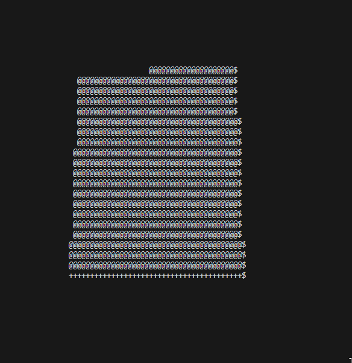

<h1 align="center"> 
  Spinning Cube
   
</h1>

<h4 align="center">A 3D spinning cube animation rendered in the console using Java</h4>

  <a href="#key-features">Key Features</a> •
  <a href="#build-instructions">Build Instructions</a> •
  <a href="#screenshot">Screenshot</a> •
  <a href="#credits">Credits</a> •
  <a href="#license">License</a>

## 🧮 Key Features
 - 3D cube rendering directly in the console/terminal
 - Smooth ASCII-based rotation animation
 - Real-time 3D transformation calculations
 - Console-based graphics using character positioning
 - Cross-platform terminal compatibility

## 🛠 Build Instructions

This project was developed using **Java**.  

To build it:
1. Clone the repository: `git clone https://github.com/fludar/spinningcube.git`
2. Navigate to the project directory: `cd spinningcube`
3. Compile the Java files: `javac *.java`
4. Run the application: `java App`

## ▶️ Usage 

Run the compiled Java application to see the spinning cube animation in your console. The cube will continuously rotate using ASCII characters and terminal positioning.

## 📸 Screenshot

## 🙏 Credits

- [Donut.c by a1k0n](https://www.a1k0n.net/2011/07/20/donut-math.html) - Mathematical inspiration for 3D ASCII rendering
- [3D Rotation Matrices](https://en.wikipedia.org/wiki/Rotation_matrix) - Mathematical foundation for 3D transformations

## 📖 What did I learn?

- 3D mathematics and transformation matrices
- Console-based graphics programming in Java
- ASCII art and character-based animations
- Projection of 3D coordinates to 2D console space
- Terminal cursor positioning and text manipulation